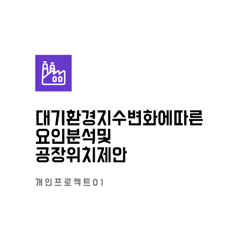
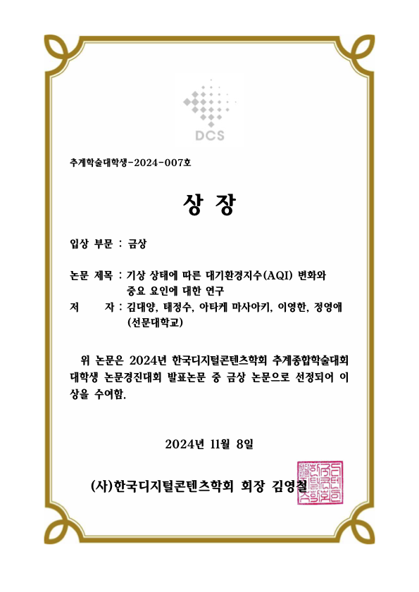

    

 

## 목차
- [프로젝트 개요](#intro)
- [프로젝트 주제](#subject)
- [프로젝트 결과](#result)

# Project

한국디지털콘텐츠학회에서 진행한 추계논문경진대회에서 발표한 논문프로젝트를 정리한 repo입니다.

## <a id="intro">Project 개요</a>

AQI(대기환경지수)를 기준으로 각 지역의 여러 요인들(기온, 습도, 위치, 계절, etc...)을 분석함으로써 적절한 요인을 찾고, 이러한 인사이트를 토대로 공장의 위치를 산업체에게 제안할 수 있도록 하는 것을 궁극적인 목적으로 진행을 한 프로젝트입니다.

[한국디지털콘텐츠학회](https://dcs.or.kr/)

## <a id="subject">Project 주제 & DataSet</a>

<b style="font-size:30">Project 주제</b>

과거에 비해서 미세먼지에 의한 피해와 그 빈도가 늘어나면서 미세먼지는 확실하게 일상생활에 영향을 미치고 있습니다.

[초미세먼지, 세계에서 10개국만 ‘좋음’…한국은 더 안좋아져](https://www.hani.co.kr/arti/international/international_general/1133084.html)

이처럼, 전세계적으로 사람들의 건강에 피해를 끼치고 있는 미세먼지가 산업체의 생산시설에서도 배출이 되며, 상당한 비율을 차지하기 때문에 추가적으로 공장을 배치할 때, 도움을 줄 수 있는 인사이트를 제공할 수 있도록 분석하는 프로젝트를 진행하였습니다.

_참고 보고서_

심창섭(2019). 미세먼지의 주요원인과 대응 전략.
[에너지경제연구원](https://www.keei.re.kr/keei/download/focus/ef1903/ef1903_30.pdf)

<b style="font-size:30">DataSet</b>

데이터 수집 사이트 : [Open-Meteo](https://open-meteo.com/)

__사용 데이터 카테고리__

| 카테고리 | 개수 |
| :---: | :---: |
| 오염물질 관련 | 7개 |
| 기상 관련 | 23개 |
| 기타 | 11개 |
| 종속변수(AQI) | 1개 |
| 총 | 42개 |

## 일정
- 메인 프로젝트 : 2024년 05월 08일 ~ 2024년 06월 12일
- 논문 프로젝트 진행 : 2024년 10월 07일 ~ 2024년 10월 25일
- 발표 : 2024년 11월 08일

## 결과물
<b>기상 상태에 따른 대기환경지수(AQI) 변화와 중요 요인에 대한 연구</b>

## <a id="result">결과</a>
<b style="font-size:25">금상 수상</b>
 

    

