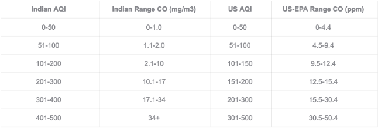
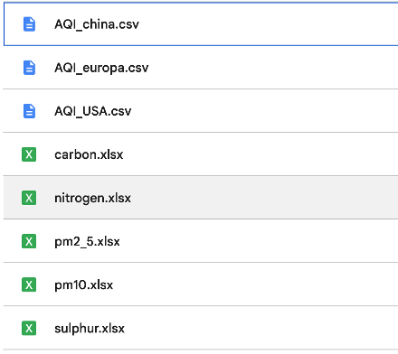

## 추계논문경진대회 프로젝트 정리

### 목차

- [데이터 분석 방법론](#data_analysis)
- [변수 구성](#variables)
- [종속변수의 산출](#calculation)
---

## <a id="data_analysis"><b>데이터 분석 방법론</b></a>
추계논문경진대회에 참여하기 전, 먼저 분석 프로젝트를 진행해야 하기때문에 분석에 필요한 지식을 얻고, 파악하는 단계부터 데이터를 수집 그 후에 분석 및 전처리까지 이어지는 과정을 대표적인 분석 방법론인 CRISP-DM 방식으로 진행을 함. 
 
<strong>이미지 출처 : [https://en.wikipedia.org/wiki/Cross-industry_standard_process_for_data_mining](https://en.wikipedia.org/wiki/Cross-industry_standard_process_for_data_mining)</strong>

---

## <a id="variables"><b>변수 구성</b></a>
데이터의 수집 이후, 탐색적 데이터 분석을 진행 이후 패턴이나 영향력을 가지고 있는 것으로 확인이 되는 변수를 정리하여 변수 구성표를 작성.

_변수 구성표_

| |변수|변수 설명|
|:---:|:---:|:---:|
| 1 | Carbon | 탄소 (μg/m³) |
| 2 | Nitrogen | 질소 (μg/m³) |
| 3 | Sulphur | 황 (μg/m³) |
| 4 | Ozone | 오존 (μg/m³) |
| 5 | Dust | 먼지 (μg/m³) |
| 6 | UV Index | 자외선 지수 |
| 7 | Temperature | 기온 (°C) |
| 8 | Wind Data | 바람 관련 데이터 |
| 9 | Soil Data | 토양 관련 데이터 |

---

## <a id="calculation"><b>종속변수의 산출</b></a> 
대기환경지수(AQI)에 대한 정의를 살펴보면 
> 대기질 지수(영어: air quality index, AQI) 또는 공기질 지수는 정부기관이 사용하는 수치의 하나로서[1] 현재 공기가 얼마만큼 오염되었고 앞으로 오염 정도가 어떻게 될지에 대한 정보

이렇게 정의 가능하다.

AQI를 종속변수로 구성을 할때, 주의를 한 점은 AQI 값 계산에 필요한 수치나 기준이 나라별로 다르기 때문에 데이터를 수집한 분석 대상 나라의 위치에 따라서 조사를 통해 적절한 기준을 세워서 종속변수의 계산을 진행.

<strong>_인도의 AQI기준_</strong>
 
<strong>_종속변수 파일 구성_</strong> 
